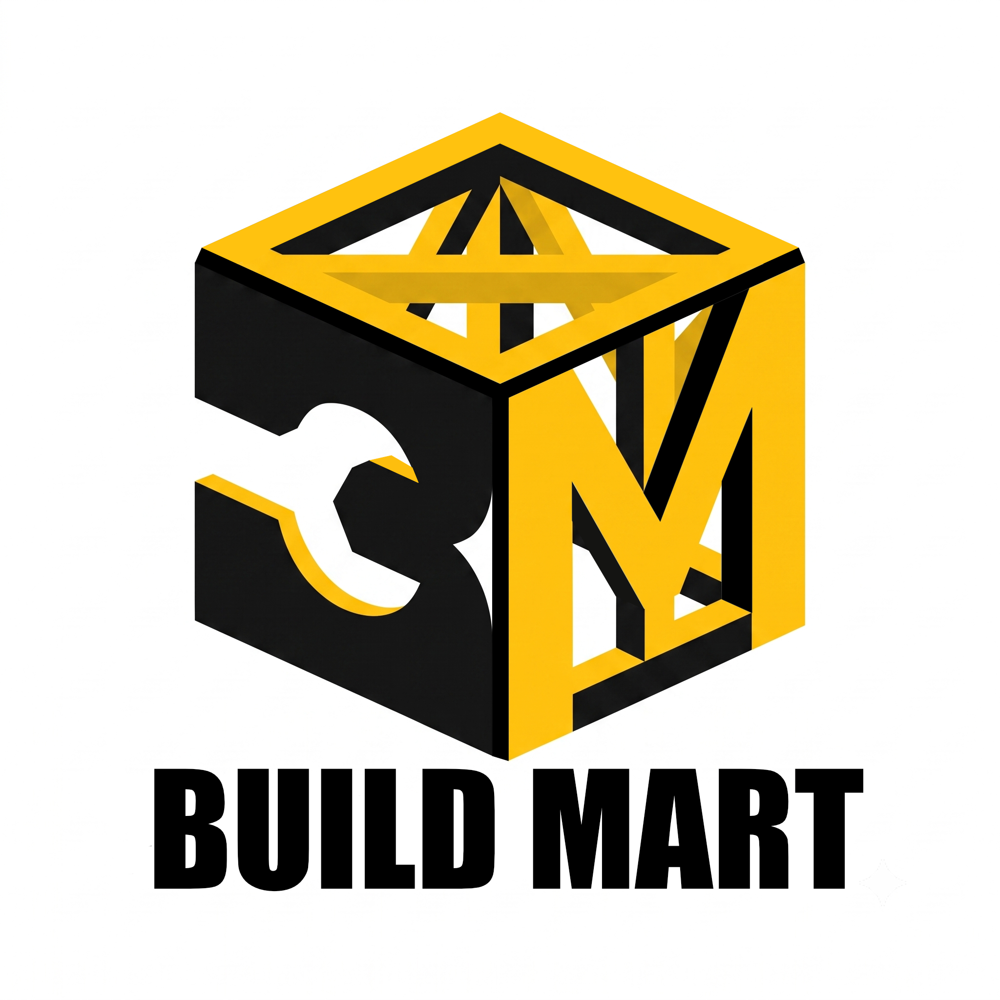

# 🏗️ BUILDMART — Next-Gen Hardware Catalog & Executive Inventory Ecosystem

<div align="center">
  
  <h1>BUILDMART PLATFORM</h1>
  <h3>Enterprise 4-Tier Hardware Storefront, Interactive Canvas Tree & Executive Dashboard</h3>
  <p>
    
    
    
    
  </p>
</div>

---

## 💎 Executive Pitch: Why BUILDMART Stands Out

BUILDMART transforms standard static hardware listings into an interactive, enterprise-grade digital distribution ecosystem. Engineered for power tool distributors, wholesalers, and modern hardware retailers, it bridges the gap between an executive telemetry dashboard and a high-converting customer storefront.

| Strategic Dimension | Conventional Hardware Catalog / Static Site | 🏗️ BUILDMART Enterprise Platform |
| :--- | :--- | :--- |
| **Catalog Exploration** | Flat scrollable lists or complex nested menus | **4-Tier Draggable 2D Canvas Graph (`tree.html`)** with interactive node folding & Bezier curves |
| **Product Inspection** | Basic static images | **Flipkart + Amazon Hybrid Gallery** with `2.2x` cursor zoom & verified quality badges |
| **Order Processing** | Complex checkout forms requiring backends | **1-Click Direct WhatsApp Order Builder** composing formatted SKUs & pricing instantly |
| **Data Management** | Manual database setups or remote SQL queries | **Live Spreadsheet Grid + Smart JSON Backup/Merge Hub** inside your browser |
| **Access Security** | Plaintext config files or server-side auth | **Client-Side SHA-256 Web Crypto Hashing (`auth.js`)** — zero plaintext passwords in code |
| **Hosting & Ops** | Expensive cloud servers & databases | **100% Static CDN Ready** with automated GitHub Actions CI/CD deployment |

---

## 🗺️ Complete Ecosystem Module Directory

| Module Page | Primary Audience | Key Features & Engineering Highlights |
| :--- | :---: | :--- |
| 📊 **`index.html`**<br>*(Executive Dashboard)* | Store Owner | • **Active Workspace File Monitor**: Live display of active JSON source file & persistence status<br>• **Architectural Metrics**: Real-time telemetry on SKU depth, category distribution & readiness<br>• **Quick Action Strip**: Immediate shortcuts to Add Inventory, Storefront & Backup Hub |
| 🛍️ **`shop.html`**<br>*(Customer Storefront)* | Customers & Shoppers | • **Flipkart + Amazon Hybrid Gallery**: Vertical thumbnail strip (`#mv_thumbs_strip`) & live switcher<br>• **High-Res Zoom Engine**: Cursor-tracking `2.2x` magnification hover effect<br>• **Trust Verification**: *"BuildMart Assured"* badges & Amazon 5-star customer review bars<br>• **WhatsApp Ordering**: Pre-fills product SKU, title, and selling price for instant ordering |
| 🌳 **`tree.html`**<br>*(Interactive Catalog Tree)* | Wholesalers & Executives | • **Full-Canvas Node Graph**: Draggable, pannable, and zoomable 2D architectural card graph<br>• **4-Tier Hierarchy**: `Root -> Category (#2563EB) -> Subcategory (#D97706) -> SKU Cards`<br>• **Zero-Mesh Layout**: Non-overlapping bounding box engine with `[+]/[-]` branch folding<br>• **Signal Pulses**: Streaming animated glowing data particles along Bezier connecting curves |
| 📦 **`products.html`**<br>*(All Products Inventory)* | Store Owner | • **Complete SKU Table**: Search, category filter, readiness status filter, and clean pagination<br>• **Resilient Rendering**: 100% safe rendering immune to missing or uninitialized fields |
| ✏️ **`add-product.html`**<br>*(Inventory Editor)* | Store Owner | • **Quick-Paste Technical Spec Extractor**: Paste raw manufacturer data (`Voltage: 220V`) for automatic key-value extraction & deduplication<br>• **Gamified Owner Growth Engine**: Progress tracks and motivation badges for catalog expansion |
| 🔀 **`settings.html`**<br>*(Smart Catalog Hub)* | Store Owner | • **Smart Universal Uploader**: Auto-detects full backups (`metadata + products`) or arrays<br>• **Dual Mode Engine**: Choose between **🔀 Merge & Update** or **🔄 Replace Entire Catalog**<br>• **Cryptographic Security Lock**: Dynamically update your SHA-256 workspace password |
| 💻 **`json-editor.html`**<br>*(Live Code Editor)* | Technical Owner | • Direct JSON inspection, spreadsheet-style batch modification & live preview cards |
| 🚫 **`404.html`**<br>*(Branded Error Page)* | Universal | • Clean hardware-branded error page with quick links to Dashboard, Storefront & Tree |

---

## 🏛️ System Architecture & Data Flow

BUILDMART utilizes a centralized browser database (`db.js`) that synchronizes seamlessly across all pages:

```
                     +--------------------------------------------------+
                     |         BUILDMART CORE ENGINE (db.js)            |
                     |   Persistent Browser Storage & 28 Seed Catalog   |
                     +--------------------------------------------------+
                                        ^                    |
             +--------------------------+                    +--------------------------+
             | Read / Write                                                             | Read Only
             v                                                                          v
+------------------------------------+                              +------------------------------------+
|     MANAGEMENT WORKSPACE           |                              |       CUSTOMER STOREFRONT          |
|  (Protected via SHA-256 auth.js)   |                              |         (Public Access)            |
|                                    |                              |                                    |
|  * Dashboard (index.html)          |                              |  * Shop Storefront (shop.html)     |
|  * Inventory Table (products.html) |                              |  * WhatsApp Order Integration      |
|  * Spec Extractor (add-product)    |                              |  * Interactive Zoom Gallery        |
|  * Smart Uploader (settings.html)  |                              |  * Assured Quality Verification    |
|  * Canvas Graph Tree (tree.html)   |                              |                                    |
+------------------------------------+                              +------------------------------------+
```

---

## 🔒 Cryptographic SHA-256 Web Crypto Security

BUILDMART implements client-side cryptographic access control (`auth.js`) designed for zero plaintext vulnerability:

| Security Layer | Cryptographic Mechanism | Advantage |
| :--- | :--- | :--- |
| **Zero Plaintext Storage** | Native Web Crypto API (`crypto.subtle.digest`) | No plaintext passwords are ever written into `.html` or `.js` source code |
| **One-Way SHA-256 Hashing** | 64-character hexadecimal digest comparison | Source code inspection reveals only hashes—passwords cannot be reversed |
| **Glassmorphic Lock Screen** | Full-screen blurred executive security overlay | Blocks unauthorized interaction on inventory management pages |
| **Public Storefront Exemption** | Selective path enforcement | Shoppers can browse `shop.html` freely without requiring authorization |

---

## 🔀 Smart Universal Catalog Uploader & Restore Hub

Located in **`settings.html`**, the Smart Catalog Uploader allows store owners to import any `.json` backup file with two distinct upload strategies:

1. **🔀 Merge & Update Mode**:
   * Scans incoming products and matches existing items by `SKU`.
   * Updates existing technical specs/prices while preserving any new items you previously added to the store.
2. **🔄 Replace Entire Catalog Mode**:
   * Performs a clean replacement of the active store inventory with the uploaded file.

---

## 🚀 Cloud Deployment & Automation

BUILDMART includes an official **GitHub Actions CI/CD workflow (`.github/workflows/deploy-pages.yml`)**:
* **Zero Manual Config**: Every `git push` to `main` automatically builds and publishes the live site to **GitHub Pages**.
* **Cache-Busting Asset Links**: Built-in query parameters (`?v=2026.07.10.CATALOG28`) ensure browsers and global CDNs serve the latest product changes instantly.

---

<div align="center">
  <p><b>BUILDMART</b> — Next-Generation Architectural Commerce & Inventory Management.</p>
</div>
